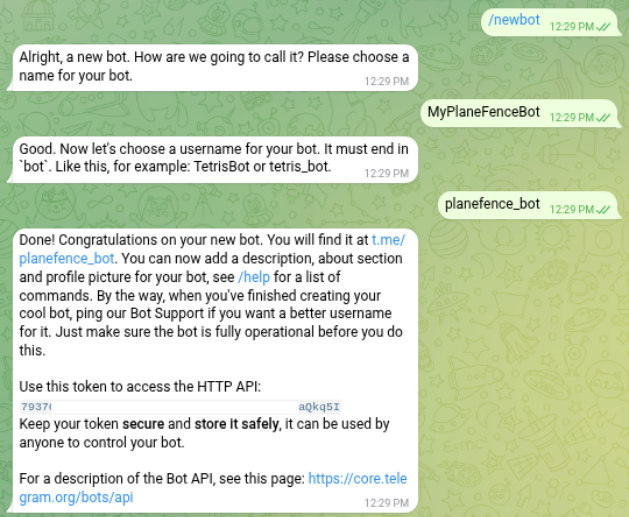

# Configure Planefence / Plane-Alert to send notifications to a Telegram Channel

- [Configure Planefence / Plane-Alert to send notifications to a Telegram Channel](#configure-planefence--plane-alert-to-send-notifications-to-a-telegram-channel)
  - [Prerequisites](#prerequisites)
  - [Step 1: Create and configure a Telegram bot](#step-1-create-and-configure-a-telegram-bot)
  - [Step 2: Create a Telegram channel you will post to](#step-2-create-a-telegram-channel-you-will-post-to)
    - [Posting to a newly created (private) channel for which you are an Administrator](#posting-to-a-newly-created-private-channel-for-which-you-are-an-administrator)
    - [Posting to an existing public channel](#posting-to-an-existing-public-channel)
  - [Step 3: Configure Planefence to send notifications to Telegram](#step-3-configure-planefence-to-send-notifications-to-telegram)
  - [Summary of License Terms](#summary-of-license-terms)

This README describes how to configure Planefence to send notifications for Planefence and/or Plane-Alert messages to Telegram.

The examples described here use the Telegram web interface. You can do most of this also using one of the Telegram Apps, but please note that some apps (for example, the iPhone app) don't allow you to do steps 2.4 and 2.5. We therefore recommend you use a browser from your computer to set this up. Telegram in the browser interface can be reached [at this link](https://web.telegram.org/a/).

## Prerequisites

This is part of the [sdr-enthusiasts/docker-planefence] docker container. Nothing in this document will make sense outside the context of this container. We assume that Planefence has been set up correctly and is working fine, and all you want to do is add Telegram notifications to your existing setup.

You should also already have a Telegram account. If you don't, please go to [Telegram](https://web.telegram.org/a/) on the web and sign up first.

## Step 1: Create and configure a Telegram bot

1. Start a conversation with [@BotFather](https://web.telegram.org/a/#93372553) on Telegram
2. Say: `/newbot`. Give it a name and a username that is unique

3. Copy the HTTP API Token. This will be the value for the`TELEGRAM_BOT_TOKEN` parameter that we will discuss below.

## Step 2: Create a Telegram channel you will post to

### Posting to a newly created (private) channel for which you are an Administrator

1. From the screen that lists all of your Chats, click the square-with-pencil icon and create a "New Channel".
2. Add **yourself** and **the bot you just created** to the channel.
3. Send a test message to the channel
4. Right-click the test message and select "Copy Message Link" *)
5. Paste the link somewhere to see the URL, which will look like this: <https://t.me/c/123456789/2>. The numbers in `c/...../` are your CHAT_ID (in our case: `123456789`). Please note this as you  will use it below.

The "Copy Message Link" option appears to be available only when you are using a web client for Telegram. Go to [https://web.telegram.org/a](Telegram on the web) and log in there to see this.

### Posting to an existing public channel

1. You must add the bot as a subscriber to the channel. You can only do this if you are an Administrator of the Channel
2. For the CHAT_ID, feel free to use the `@ChannelName` value, or follow steps 4 and 5 above to get the numeric ID.

## Step 3: Configure Planefence to send notifications to Telegram

Edit your `planefence.config` file, and add or modify the following parameters:

```config
TELEGRAM_BOT_TOKEN=""         # set this parameter to the HTTP API Token you got in Step 1
TELEGRAM_CHAT_ID=""           # set this parameter to the CHAT_ID you got in Step 2
PF_TELEGRAM_ENABLED=false     # Set this to "on"/"enabled"/"1"/"yes"/"true" to start sending Planefence notifications
PA_TELEGRAM_ENABLED=false     # Set this to "on"/"enabled"/"1"/"yes"/"true" to start sending Plane-Alert notifications
```

## Summary of License Terms

This program is free software: you can redistribute it and/or modify
it under the terms of the GNU General Public License as published by
the Free Software Foundation, either version 3 of the License, or
(at your option) any later version.

This program is distributed in the hope that it will be useful,
but WITHOUT ANY WARRANTY; without even the implied warranty of
MERCHANTABILITY or FITNESS FOR A PARTICULAR PURPOSE.  See the
GNU General Public License for more details.

You should have received a copy of the GNU General Public License
along with this program.  If not, see <https://www.gnu.org/licenses/>.
